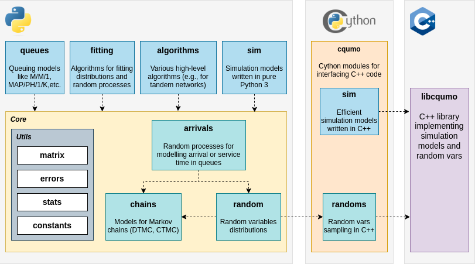

.. _user_guide:

**********
User guide
**********

PyQumo provides a set of models for studying various queueing systems with Markovian arrivals and service times.
It heavily uses ``numpy`` and ``scipy`` and provides C++ implementations for the most complex parts of the code.

The key design idea behind PyQumo design is:

- provide high-level algorithms in Python, so they can be easily read, studied and maintained;
- use C/C++ to implement computational heavy tasks;
- use Cython only as an interface between Python and C++.

Packet structure is shown in the diagram:

On the top level PyQumo provides algorithms for simulation and analyzes of queueing models and means for fitting arrival
processes and distributions:

- ``queues`` module provides algorithms for computation of queueing models properties;
- ``fitting`` module contains implementations of various distributions fitting methods;
- ``sim`` module provides simple simulation models written in pure Python for studying properties of complex queueing systems;
- ``algorithms`` module contains algorithms for working with complex queueing systems, like properties estimation of a tandem queueing network.
- ``cqumo.sim`` module provides efficient implementations of simulation models written in C++ and accessible from Python via Cython interface.

The top level modules use the core that provides models for random variables, arrival processes, Markovian chains and other basic entities:

- ``random`` module provides models for random variables and distributions;
- ``chains`` module provides models for Markovian chains;
- ``arrivals`` module provides models for arrival and service processes;

These core modules use a set of utility modules with matrices manipulation routines, statistics estimation, errors
handling and other staff.
